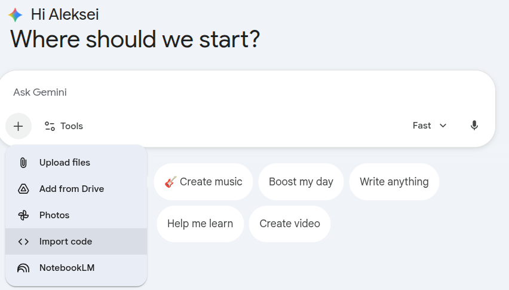
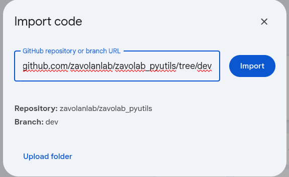

# Documentation

## Status: TO DO

Detailed documentation is currently under development. 

For now, please refer to:
- [test_module.ipynb](../test_module.ipynb) - Working example with sample data
- Function docstrings in the source code
- [Main README](../README.md) - Quick start guide

Alternatively, and powerfully, use AI:

